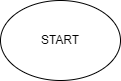

# Первая итоговая проверочная работа.
## Что требуется сделать?

### Необходимо сделать:
1. Создать репозиторий на GitHub
2. Нарисовать блок-схему алгоритма (можно обойтись блок-схемой основной содержательной части, если вы выделяете ее в отдельный метод)
3. Снабдить репозиторий оформленным текстовым описанием решения (файл README.md)
4. Написать программу, решающую поставленную задачу.
5. Использовать контроль версий в работе над этим небольшим проектом (не должно быть так что все залито одним коммитом, как минимум этапы 2, 3 и 4 должны быть расположены в разных коммитах)

## Задача: Написать программу, которая из имеющегося массива строк формирует массив из строк, длина которых меньше либо равна 3 символа. Первоначальный массив можно ввести с клавиатуры, либо задать на старте выполнения алгоритма.

### Примеры:
* ["hello", "2", "world", ":-)"] -> ["2", ":-)"]
* ["1234", "1567", "-2", "computer science"] -> ["-2"]
* ["Russia", "Denmark", "Kazan"] -> []

## Описание алгоритма решения:
1. Объявляется два массива: исходный и второй такой же длины.
2. Пишется метод, в котором цикл с количеством итераций, равным количеству элементов массива.
3. Внутри цикла осуществляется выборка элементов массива по условию "<=3". Отобранные элементы попадают во второй массив.
4. Счетчик нужен для поочередного заполнения элементов второго массива. По мере осуществления выборки счетчик увеличивается на 1.
5. Далее в цикле i увеличивается на 1. И так повторяется, пока i не станет равным количеству элементов в массиве.

## Блок-схема алгоритма:
